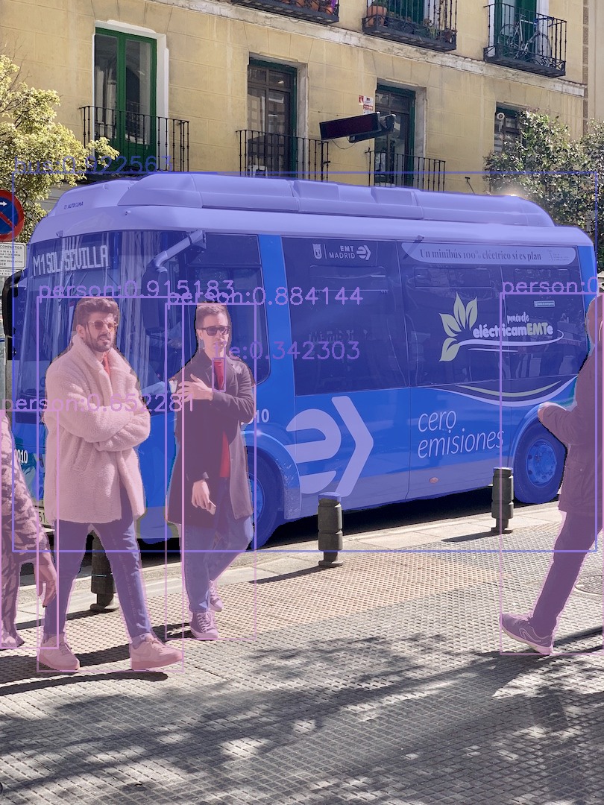

# yolov8-opencv-onnxruntime-cpp
## 使用OpenCV-dnn和ONNXRuntime部署yolov8目标检测和实例分割模型<br>
基于yolov8:https://github.com/ultralytics/ultralytics

## requirements for opencv-dnn
1. > OpenCV>=4.7.0<br>
OpenCV>=4.7.0<br>
OpenCV>=4.7.0<br>

2. export for opencv-dnn:</br>
> ```yolo export model=path/to/model.pt format=onnx dynamic=False  opset=12```</br>

## requirements for onnxruntime （only yolo*_onnx.h/cpp）
>opencv>=4.5.0 </br>
ONNXRuntime>=? </br>

## 更新说明：
#### 2023.02.07 更新：</br>
+ yolov8使用opencv-dnn推理的话，目前只支持opencv4.7.0及其以上的版本，我暂时也没找到怎么修改适应opencv4.5.0的版本（￣へ￣），这个版本需求和onnxruntime无关，onnxruntime只需要4.5.0的版本,4.x的版本应该都可以用，只要能正确读取，有```cv::dnn::blobFromImages()```这个函数即可,如果真的没有这个函数，你自己将其源码抠出来用也是可以的，或者大佬们自己实现该函数功能。
+ 而目前opencv4.7.0的版本有问题（https://github.com/opencv/opencv/issues/23080) ，如果你的CPU不支持```AVX2```指令集，则需要在```net.forward()``` 前面加上```net.enableWinograd(false);```来关闭Winograd加速，如果支持这个指令集的话可以开启加速（蚊子腿）。

依照惯例贴一张yolov8-seg.onnx在640x640下用onnxruntime运行结果图：

